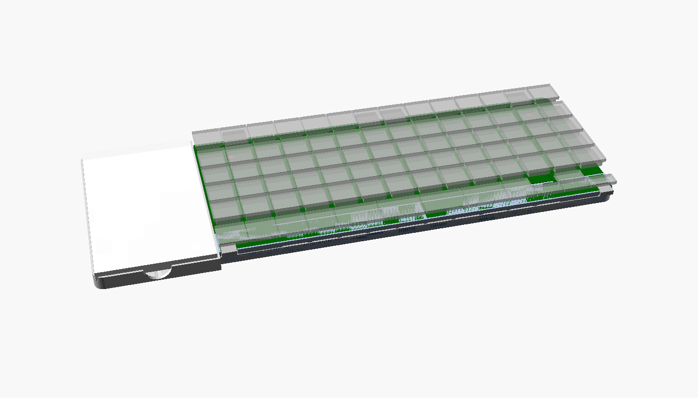
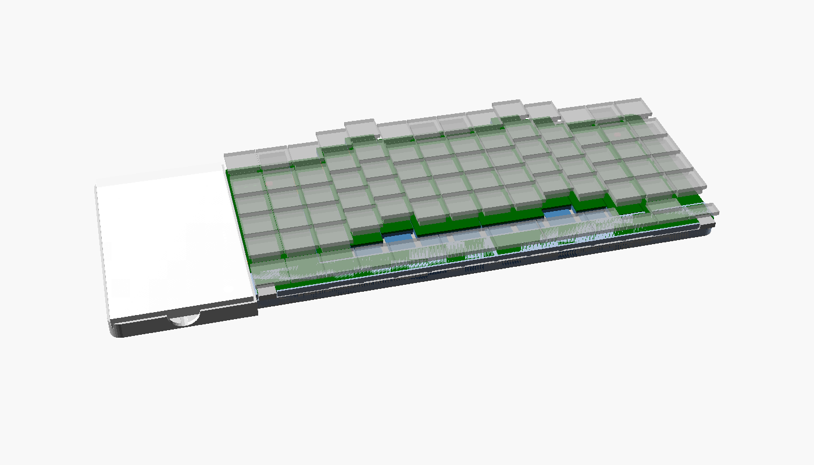
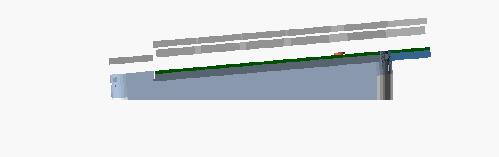
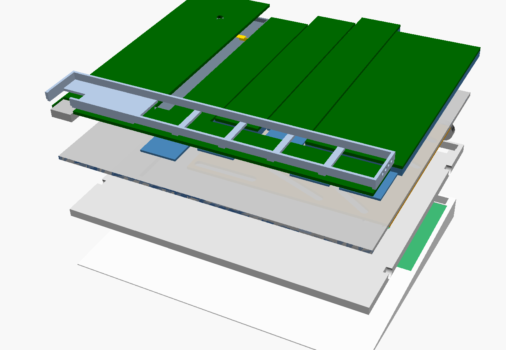

# Yggi Keyboard

**Um teclado split ortholinear que vira column stagger com um clique.** Open hardware e open source.


Em ortholinear, as duas metades formam um retângulo perfeito, como um teclado comum. Aperte o botão ao lado dos LEDs e uma mola faz as colunas deslizarem inteiras até o stagger escolhido (50, 100 ou 150%). Para voltar, empurre as colunas até ouvir o clique.

O nome é uma homenagem a Yggdrasil, a árvore que liga os nove mundos da mitologia nórdica. O objetivo de longo prazo é que o Yggi seja o centro que liga os seus computadores e periféricos.

**[▶ Abrir a simulação interativa](https://htmlpreview.github.io/?https://github.com/irissonnlima/yggi-keyboard/blob/main/docs/simulacao.html)** ([arquivo](docs/simulacao.html)): vista de cima com antes e depois, corte lateral, **raio-x dos circuitos** (placa-mãe, placas das colunas, cabos flat, MCU, bateria, USB-C, ímãs e pogo), diagrama das ligações e o ciclo da mola em corte.

---

## Estado atual

| | |
|---|---|
| **Fase** | 1 · teclado Bluetooth com mecanismo de stagger |
| **CAD** | [`hardware/stagger-mechanism/yggi_v3.scad`](hardware/stagger-mechanism/yggi_v3.scad) (OpenSCAD, paramétrico) |
| **Layout** | [`layout/yggi-v9-B-ortho.json`](layout/yggi-v9-B-ortho.json) (Keyboard Layout Editor) |
| **Verificado** | todas as peças compilam; nenhuma colisão entre peças em 0, 50, 100 e 150% |
| **Ainda não testado** | nada foi impresso ou montado |

| Ortholinear (0%) | Column stagger (150%) |
|---|---|
|  |  |

**Vista lateral** (inclinação de 5° dada pela cunha da bateria):



**Metade esquerda explodida** (cunha com bateria e MCU, bandeja, placa-came, chassi, gavetas, bloco fixo e barra do polegar):



---

## Layout

Split 7 + 7 colunas com layout Mac, 79 teclas, mais uma baia para um e-reader destacável.

- **2 colunas externas fixas de cada lado:** esc, a **tecla Yggi** (troca de computador) com **3 LEDs** que indicam o aparelho, `` ` ``, e tab, caps e shift de 2u.
- **Colunas móveis:** mindinho, anelar, médio e indicador. Cada uma sobe o quanto o dedo precisa: médio +15 mm, anelar e indicador +9 mm, mindinho 0.
- **Barra do polegar fixa:** fn ⌃ ⌥ ⌘ ⌫ ␣ | ␣ ↩ ⌘ e setas de 0,5u, no estilo Magic Keyboard.
- **Baia de 4u × 6,5u** para um e-reader do tamanho do XTeink X4 (69 × 114 mm).

**Tecla Yggi:** toque vai para o próximo computador pareado. Segurar + 1…5 vai direto para um computador. Segurar 3 s entra em pareamento. A troca só acontece ao soltar a tecla, então um toque acidental não muda nada.

---

## Como o mecanismo funciona

Cada metade, de baixo para cima:

1. **Cunha** (impressa): cria a inclinação de 5° e guarda a **bateria**, o tambor da **mola** e o curso da **trava**.
2. **Bandeja**: bolsão da placa-came, canal da fita da mola e dos fios, lingueta da trava e furos do batente.
3. **Placa-came** (chapa de 1,2 mm): tem 8 rasgos inclinados, 2 por coluna móvel. Ao deslizar 24 mm em X, empurra cada coluna em Y na proporção do rasgo. A posição dos pinos foi escolhida por busca para os rasgos nunca se cruzarem (folga mínima de 9 mm).
4. **Chassi = placa-mãe** (FR4 de 1,6 mm, fixa): tem os rasgos-guia em Y e é também a placa de circuito principal, com microcontrolador, carregador, USB-C e contatos pogo. Fica sempre escondida embaixo das colunas.
5. **Gavetas**: cada coluna móvel é um trenó impresso com **a sua própria placa de circuito** em cima (switches Choc montados direto na placa, com soquetes hot-swap). Um **cabo flat em laço rolante**, dentro da coluna, liga essa placa à placa-mãe logo abaixo. Dois pinos-parafuso por gaveta fazem o papel de guia, came e trava contra levantar. A **saia** da frente sai de baixo da barra do polegar e tampa o vão quando a coluna sobe.
6. **Bloco fixo** e **barra do polegar**: não se movem.

**Mola e trava:**
- Uma **mola de força constante** (fita de aço, tipo trena) puxa a placa-came para o stagger o tempo todo.
- Em ortho, uma **lingueta** com dente entra num furo da placa e segura tudo.
- O **botão** ao lado dos LEDs empurra o dente para baixo, e a mola leva as colunas até o **pino de batente** (50, 100 ou 150%, trocável por baixo).
- Para voltar, é só empurrar as colunas. Os rasgos são inclinados o bastante (~32°) para o movimento voltar pela came, e o dente estala de volta no furo.

**Módulos:** as faces de encaixe são retas, com ímãs de 4 × 2 mm e 4 contatos pogo (energia + dados). As bordas externas são arredondadas. Com as metades juntas, um único USB-C carrega tudo. Separadas, cada metade funciona sozinha por Bluetooth.

---

## Eletrônica

| | |
|---|---|
| **Placas por metade** | **7**: a placa-mãe (o chassi), **uma por coluna móvel** (4, sendo 3 iguais de 1u e 1 de 2u), a do bloco fixo e a da barra do polegar. |
| **Microcontrolador** | um **nRF52840** por metade (módulo de 13 × 18 mm), **soldado na placa-mãe, embaixo do bloco fixo**, junto com o carregador e o USB-C na borda de trás. |
| **Por que nRF52840** | é o chip mais bem suportado pelo ZMK. Tem 21 GPIO, o suficiente para a matriz 6 × 7 mais os 3 LEDs. |
| **Firmware** | [ZMK](https://zmk.dev) (Zephyr, MIT): Bluetooth, split sem fio, 5 perfis de computador, bateria. Funções do Yggi (tecla de troca, LEDs, conversa com o e-reader) entram como **módulos ZMK** próprios. |
| **Bateria** | LiPo de 4 mm na cunha, ~1800 mAh por metade (76 × 46 mm). A cunha comporta células maiores se a inclinação aumentar. |
| **Ligação das colunas** | cada placa de coluna leva só as 5 linhas e 1 ou 2 colunas da matriz: **cabo flat de 8 vias em laço rolante** até a placa-mãe. Como o stagger muda poucas vezes por dia, o cabo dobra pouco. No protótipo impresso, fios de silicone com folga. |
| **Partes fixas** | bloco fixo e barra do polegar se ligam à placa-mãe por conectores placa-a-placa, sem nenhum movimento. |

O **e-reader** (fase 2) tem cérebro próprio. A base sugerida é o firmware open source [CrossPoint](https://github.com/crosspoint-reader/crosspoint-reader) (ESP32). Encaixado, ele mostra o estado do teclado. Solto, é um leitor.

---

## Estrutura do repositório

```
docs/
  simulacao.html          simulação interativa: vista de cima, corte, raio-x e mola
  media/                  GIF e imagens do README
hardware/stagger-mechanism/
  yggi_v3.scad            CAD atual (mecanismo fino, inclinado, com mola)
  yggi_v2.scad            versão anterior (histórico)
  yggi_stagger.scad       primeiro protótipo, 5 colunas (histórico)
  renders/                imagens geradas pelo OpenSCAD
layout/
  yggi-v9-B-*.json        layout atual para o Keyboard Layout Editor
tools/
  make_gif.py             junta os PNGs do OpenSCAD num GIF (sem dependências)
```

## Como abrir e gerar

**CAD:** instale o [OpenSCAD](https://openscad.org) (versão *snapshot*) e abra `yggi_v3.scad`. Em **Window → Customizer** dá para mexer em `stagger_pct`, `stop_pct`, `explode`, `joined` e `show_internals`.

```bash
brew install --cask openscad@snapshot
```

**Exportar uma peça em STL:**

```bash
openscad -D 'part="cam_plate"' -o placa-came.stl hardware/stagger-mechanism/yggi_v3.scad
```

**Verificar colisões:** a opção `part="check"` com `check=...` mostra a interseção entre duas peças. Resultado vazio significa sem colisão.

```bash
openscad --backend=manifold -D 'part="check"' -D 'check="gav_chassis"' -D 'stagger_pct=150' -o /tmp/c.stl hardware/stagger-mechanism/yggi_v3.scad
```

**Refazer o GIF:**

```bash
for p in 0 25 50 75 100 125 150; do openscad -D "stagger_pct=$p" -D 'stop_pct=150' --camera=90,45,0,55,0,-15,600 --imgsize=760,420 --colorscheme=Tomorrow -o "/tmp/f$p.png" hardware/stagger-mechanism/yggi_v3.scad; done
```

```bash
python3 tools/make_gif.py docs/media/yggi-stagger.gif /tmp/f0.png /tmp/f25.png /tmp/f50.png /tmp/f75.png /tmp/f100.png /tmp/f125.png /tmp/f150.png --pingpong
```

---

## Roteiro

1. **Fase 1 · teclado:** imprimir e testar o mecanismo (bandeja, placa-came, chassi e 2 gavetas primeiro), depois firmware ZMK e placas de circuito por gaveta.
2. **Fase 2 · e-reader destacável:** tela, estado do teclado, leitura.
3. **Fase 3 · hub:** mouse, trackpad e áudio passando pelo Yggi.

**Pendências conhecidas:**
- Switch das setas de 0,5u (o Choc não cabe em meia altura).
- Estabilizadores das teclas de 2u.
- Escolher a mola de força constante e a bateria reais.
- Testar folgas e a força da trava na prática.

## Licença

A definir. Sugestão: **CERN-OHL-S-2.0** para o hardware e **MIT** para o firmware, a mesma do ZMK.
