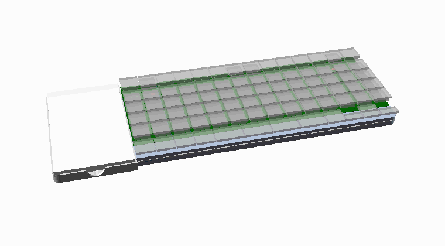
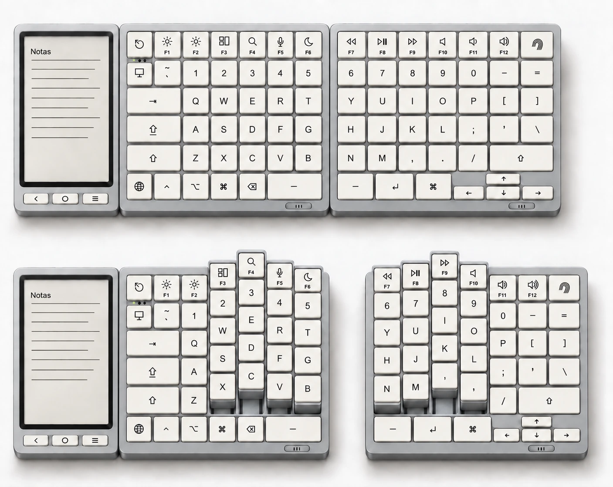
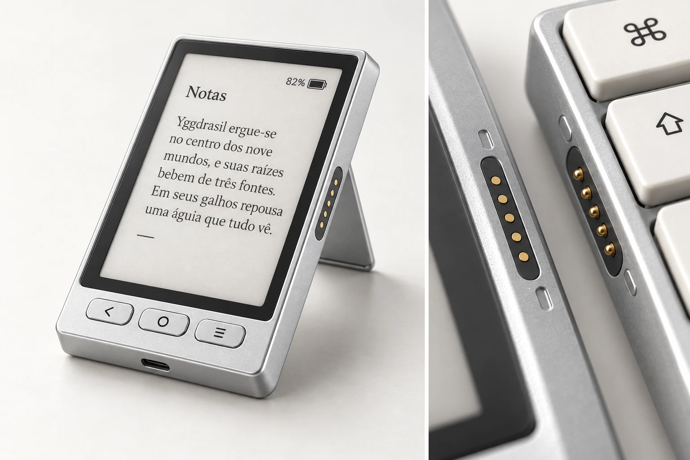

# Yggi Keyboard

**Um teclado split ortholinear que vira column stagger com um clique.** Open hardware e open source.

O nome é uma homenagem a Yggdrasil, a árvore que liga os nove mundos da mitologia nórdica. O objetivo de longo prazo é que o Yggi seja o centro que liga os seus computadores e periféricos.

## Conceito de design

> Imagens de conceito para guiar o visual do produto. O projeto técnico (medidas, mecanismo, placas) está em [`hardware/`](hardware/).

**Ortholinear e column stagger.** Em cima, o teclado fechado: um retângulo perfeito, com a baia do e-reader à esquerda. Embaixo, as colunas destravadas e deslizadas no stagger: as colunas externas e a fileira do polegar ficam fixas.

**Colunas que deslizam inteiras.** Cada coluna corre sobre trilhos, e o vão que ela deixa fica aparente e acabado, sem moldura solta.

**E-reader destacável e conectores.** O e-reader tem tela e-ink, três botões, apoio de mesa e USB-C próprio. Ele encaixa na lateral do teclado por uma fileira de contatos pogo, com ímãs acima e abaixo.

## Onde está cada coisa

| Pasta | O que tem |
|---|---|
| [`hardware/`](hardware/) | mecanismo de stagger (CAD), placas de circuito, layout das teclas, simulação interativa |
| [`app/`](app/) | app do computador: núcleo em Rust + interface macOS em SwiftUI ([como rodar](app/README.md)) |
| [`docs/`](docs/) | documentação do produto: [funcionalidades](docs/funcionalidades.md), [app](docs/app.md) e imagens de conceito |

Ainda virá `firmware/` (ZMK + módulos Yggi).

## Fases

1. **Teclado Bluetooth** com o mecanismo de stagger.
2. **E-reader destacável** que encaixa no teclado.
3. **Hub**: mouse, trackpad e áudio passando pelo Yggi.

**[▶ Simulação interativa](https://htmlpreview.github.io/?https://github.com/irissonnlima/yggi-keyboard/blob/main/hardware/docs/simulacao.html)**

## Licença

A definir. Sugestão: **CERN-OHL-S-2.0** para o hardware e **MIT** para firmware e software.
