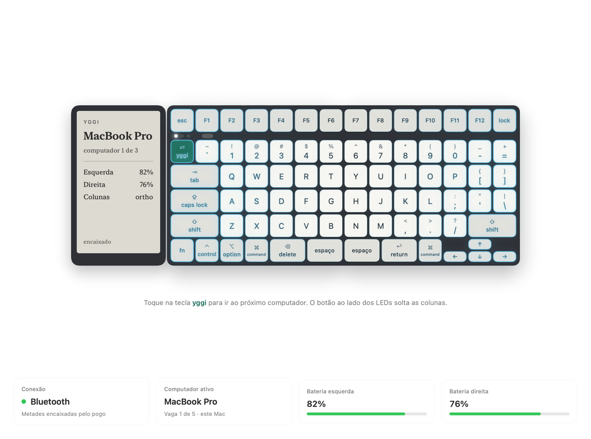
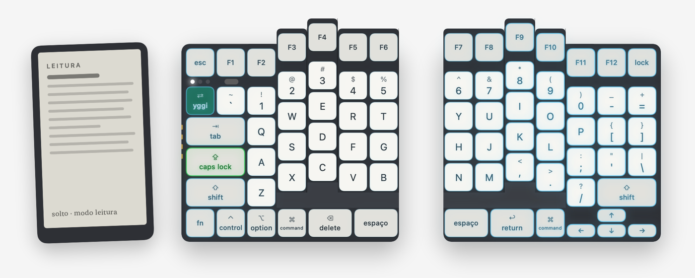
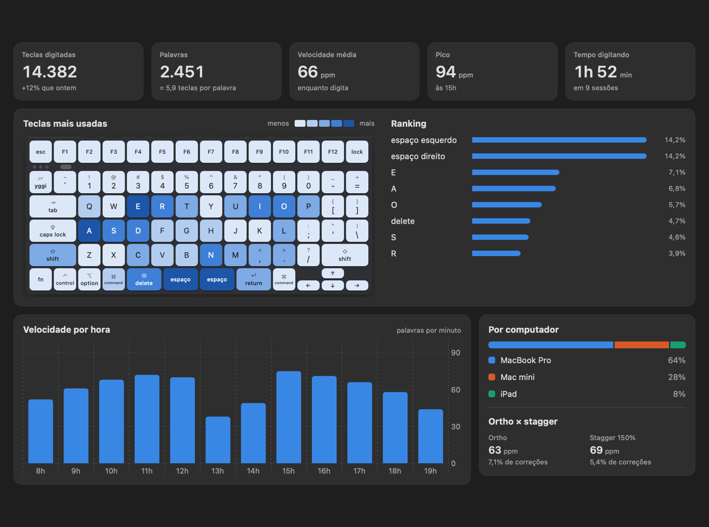

# Yggi · app do computador

App do teclado Yggi: estado (computador ativo, baterias, conexão, stagger, e-reader), luzes de cada tecla, estatísticas de digitação e, depois, o editor de teclas. Hoje roda no **macOS**, com um **teclado simulado**, porque o firmware ainda não existe.



| Metades separadas, e-reader solto, stagger | Estatísticas (tema escuro) |
|---|---|
|  |  |

Decisões e arquitetura: [docs/app.md](../docs/app.md). Design das telas: [canvas no Claude](https://claude.ai/artifact/6vRzYKWAszEfThTY9fC1pt) (privado; compartilhe pelo menu Share do canvas).

## Telas

| Tela | O que faz |
|---|---|
| **Barra de menus** | baterias, computadores (clique para trocar), conexão, abrir o app, Ajustes |
| **Visão geral** | o teclado desenhado ao vivo: stagger (as colunas sobem com mola), metades juntas ou separadas, e-reader encaixado/solto, LEDs de computador e luzes |
| **Teclas e camadas** | o que cada tecla faz (só leitura até existir o protocolo do ZMK Studio no firmware) |
| **Luzes e efeitos** | LED RGB em cada tecla, em 3 camadas: efeito geral < cores por tecla < teclas de ação |
| **Estatísticas** | teclas, palavras, velocidade, mapa de calor, por computador, ortho × stagger (só contagens, nunca o texto) |
| **Ajustes** (⌘,) | aparência Sistema / Claro / Escuro e opções gerais |

No simulado, o menu **Simulador** da barra de ferramentas faz o que o teclado faria sozinho: cenários (bateria baixa, desconectado…), caps lock, pareamento, cabo USB-C.

## Como está dividido

```
app/
  core/                 núcleo em Rust (yggi-core): toda a lógica, sem interface
    src/model.rs          estado do teclado: conexão, baterias, computadores, stagger, e-reader
    src/layout.rs         onde cada tecla fica e quanto cada coluna sobe no stagger
    src/lighting.rs       luzes: regras (LightingConfig) e LightingEngine, que calcula cada quadro
    src/stats.rs          estatísticas (formato + dados do simulador)
    src/keyboard.rs       interface Keyboard (simulado ou real) e erros
    src/simulator.rs      teclado simulado e seus cenários (+ testes)
    src/session.rs        KeyboardSession: o que as interfaces chamam
  macos/                interface macOS em SwiftUI (só telas)
    Yggi.xcodeproj
    Yggi/                 app: YggiApp, KeyboardStore, Theme
      Views/Keyboard/       o teclado e o e-reader desenhados a partir do layout do núcleo
      Views/Screens/        Visão geral, Teclas, Luzes, Estatísticas
      Views/                barra lateral, barra de menus, Ajustes
    YggiCore/             pacote Swift que embrulha o núcleo (a ponte é gerada)
  scripts/build-core.sh compila o núcleo e gera a ponte Swift (UniFFI)
  Makefile              atalhos: make core, make run, make test…
```

O núcleo não sabe nada de interface. A interface não sabe nada de Bluetooth, simulador ou regras do teclado: ela chama `KeyboardSession`, desenha o `KeyboardState` que recebe e, para as luzes, pede a cada quadro `LightingEngine.frame(...)`, que devolve a cor e a intensidade de cada tecla. O layout das teclas (`yggiLayout()`) e a subida das colunas (`columnLift`) também vêm do núcleo. Para levar o app a Windows ou Linux, reaproveita-se `core/` inteiro e escreve-se só a interface.

## Pré-requisitos

| | Versão testada | Como instalar |
|---|---|---|
| macOS | 14 ou mais novo | |
| Xcode | 16 ou mais novo (testado no 27) | App Store |
| Rust | estável (testado no 1.98) | `curl --proto '=https' --tlsv1.2 -sSf https://sh.rustup.rs \| sh` |

Não precisa de mais nada: o gerador da ponte (UniFFI) é compilado pelo próprio Cargo. Se o `xcode-select` apontar para as Command Line Tools, o `Makefile` usa o Xcode de `/Applications` sozinho.

## Rodar

De dentro da pasta `app/`:

```bash
make run
```

Compila o núcleo, gera a ponte, compila o app, instala em `~/Applications` (o Dock, o Spotlight e o Launchpad acham ele lá) e abre a janela. É um app normal, com ícone no Dock, e também tem o ícone do teclado na barra de menus: clicar abre o balão com os widgets; clique direito tem "Abrir Yggi…", "Ajustes…" e "Sair".

Outros comandos (`make help` lista todos):

| Comando | O que faz |
|---|---|
| `make test` | testes do núcleo (`cargo test`) |
| `make core` | só compila o núcleo e gera a ponte Swift |
| `make xcode` | gera a ponte e abre o projeto no Xcode (depois é só ⌘R) |
| `make snapshots` | desenha telas e estados do teclado em PNG, claro e escuro, em `build/snapshots` (conferência visual; seletores nativos saem como caixas amarelas) |
| `make universal` | núcleo para Apple Silicon e Intel (precisa de `rustup target add x86_64-apple-darwin`) |
| `make clean` | apaga tudo que foi gerado |

**Mexeu no núcleo em Rust?** Rode `make core` (ou `make run`) antes de compilar no Xcode: a ponte Swift e a biblioteca são geradas por esse passo, não pelo Xcode.

## O que é gerado (e não vai para o Git)

| Arquivo | Gerado por |
|---|---|
| `core/target/` | Cargo |
| `macos/YggiCore/YggiCoreFFI.xcframework` | `scripts/build-core.sh`: biblioteca estática + cabeçalho C |
| `macos/YggiCore/Sources/YggiCore/yggi_core.swift` | `scripts/build-core.sh`: ponte Swift do UniFFI |
| `build/` | `xcodebuild` |

## Como a ponte funciona

1. `cargo build` gera `libyggi_core.a` (usada pelo app) e `libyggi_core.dylib` (só para ler os metadados).
2. O `uniffi-bindgen` lê a `.dylib` e escreve `yggi_core.swift` + o cabeçalho C.
3. O `xcodebuild -create-xcframework` junta a biblioteca e o cabeçalho num `.xcframework`.
4. O pacote `YggiCore` expõe tudo ao app como um módulo Swift comum (`import YggiCore`).

No núcleo, o que atravessa a ponte é marcado com `#[uniffi::export]`, `uniffi::Record`, `uniffi::Enum` ou `uniffi::Object`. No Swift, os nomes viram camelCase (`select_host` → `selectHost(index:)`).

Os avisos do núcleo (`StateListener`) chegam de outra thread. O `KeyboardStore` os passa para a thread principal na ordem em que chegaram.

## Próximos passos

1. `BluetoothKeyboard` no núcleo: bateria pelo Battery Service do ZMK; computador ativo, stagger, e-reader, luzes e estatísticas por um serviço Yggi (módulo ZMK, quando o firmware existir).
2. `ZMKStudioClient`: protocolo do ZMK Studio (protobuf por USB ou Bluetooth) para o editor de teclas.
3. Macros e firmware (itens ainda fora da barra lateral).
4. Interfaces para Windows e Linux sobre o mesmo núcleo.
