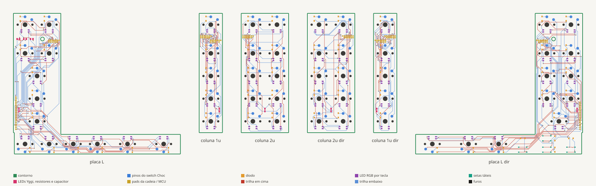

# Placas de circuito do Yggi (rev0)



Cada metade usa **5 placas em cadeia**:

```
placa L  ──►  coluna 1u  ──►  coluna 1u  ──►  coluna 1u  ──►  coluna 2u
(MCU)         (mindinho)      (anelar)        (médio)         (indicador)
```

- **Placa L**: bloco fixo (esc, Yggi, `` ` ``, tab, caps, shift) e barra do polegar (fn, ⌃, ⌥, ⌘, ⌫, espaço) numa peça só, em forma de L. As duas partes são fixas e ficam no mesmo plano. É a placa do microcontrolador.
- **Coluna 1u** (×3, **idênticas**): 5 switches Choc e 5 diodos.
- **Coluna 2u** (indicador, fim da cadeia): 10 switches e 10 diodos.
- A metade direita usa as mesmas placas, espelhadas.

As placas saem em duas etapas: o [Ergogen](https://ergogen.xyz) posiciona switches, diodos e pads a partir de [`ergogen/generate.py`](ergogen/generate.py), e o [`route.py`](route.py) termina cada placa no KiCad (diodos SOD-123, LEDs, regras da JLCPCB, trilhas pelo [Freerouting](https://github.com/freerouting/freerouting) e DRC). Os resultados ficam versionados:

| Arquivo | O que é |
|---|---|
| [`kicad/*.kicad_pcb`](kicad/) | placas roteadas para o KiCad 10, com DRC limpo (0 violações, 0 ligações faltando) |
| [`kicad/metade_esquerda*.kicad_pcb`](kicad/) | **só para ver**: as 5 placas de uma metade juntas, na posição do CAD (ortho e stagger 150%), com as redes reais da matriz; os jumpers aparecem como linhas de ligação. Gerado por [`assemble.py`](assemble.py) |
| [`kicad/*.kicad_pro`](kicad/) | regras de projeto (trilha 0,25, isolamento 0,2, via 0,6/0,3, borda 0,5) |
| [`outlines/*.dxf`](outlines/) | contornos de corte, os mesmos usados no CAD |
| [`preview.svg`](preview.svg) | a prévia acima (`python3 hardware/tools/pcb_preview.py`) |

## A ligação em cadeia

Cada placa se liga à vizinha por um **jumper flexível de 10 vias**, que atravessa as paredes das colunas na **faixa livre entre a fileira F e a dos números** (y = 87,25 mm no CAD). É o único corredor sem switches ao longo de toda a coluna.

As colunas vizinhas andam uma em relação à outra quando o stagger muda. Com o perfil padrão em 150%, a diferença é:

| Ligação | Movimento relativo |
|---|---|
| placa L → mindinho | 0 mm |
| mindinho → anelar | 9 mm |
| anelar → médio | 6 mm |
| médio → indicador | 6 mm |

O jumper e os rasgos nas paredes foram dimensionados para **até 15 mm**, então qualquer perfil de placa-came funciona.

- **Protótipo:** 10 fios de silicone 30 AWG (flat de silicone), soldados nos pads.
- **Produto:** jumper em placa flexível (FPC) de pé, com 1,6 mm de altura, dobrado em S.

### Barramento rotativo: por que as 3 placas de 1u são iguais

Os dois blocos de pads (entrada **J_IN** e saída **J_OUT**) têm a mesma ordem:

| Pad | 1 | 2 | 3 | 4 | 5 | 6 | 7 | 8 | 9 | 10 |
|---|---|---|---|---|---|---|---|---|---|---|
| **J_IN** | R0 | R1 | R2 | R3 | R4 | C1 | C2 | C3 | C4 | C5 |
| **J_OUT** | R0 | R1 | R2 | R3 | R4 | C2 | C3 | C4 | C5 | — |

Cada placa **usa a coluna C1** e repassa as outras deslocadas uma posição. Na placa seguinte, o que era C2 chega como C1, e assim por diante. Por isso a mesma placa serve em qualquer posição da cadeia. A coluna 2u usa C1 e C2 e não tem saída.

### Matriz (uma metade)

**6 linhas × 7 colunas = 13 pinos do MCU**, mais 3 para os LEDs.

| Linha | Teclas |
|---|---|
| R0 | fileira F |
| R1 | números (inclui a tecla Yggi) |
| R2, R3, R4 | letras (tab, caps e shift de 2u estão em COL0) |
| R5 | barra do polegar (fica toda na placa L) |

| Coluna | Onde fica |
|---|---|
| COL0, COL1 | bloco fixo, na placa L |
| COL2 | 1ª placa de 1u (mindinho) |
| COL3 | 2ª placa de 1u (anelar) |
| COL4 | 3ª placa de 1u (médio) |
| COL5, COL6 | placa 2u (indicador) |

Diodos no sentido **COL2ROW**, o padrão do ZMK: coluna → switch → diodo → linha.

## Decisões e limites da rev0

- **Sem soquete hot-swap Kailh.** O soquete passa ~0,9 mm da borda de uma coluna de 17,4 mm e bateria na parede do trenó. As placas usam os **furos passantes do Choc**: dá para soldar o switch ou usar **soquetes Mill-Max** (tubinhos dentro do furo) e manter a troca de switches.
- **MCU externo na rev0.** A placa L tem um **cabeçalho de 18 pads** (GND, R0–R5, COL0–COL6, LED1–3). Na bancada, ele se liga por fios a uma placa nRF52840 (nice!nano / Pro Micro), como combinamos para as protoboards.
- **Na rev1** entram na própria placa L: o módulo nRF52840 (~10 × 15,5 mm), o carregador, o conector da bateria e o USB-C. As posições já estão reservadas no CAD: o MCU ao lado das teclas de 2u, e o USB-C na frente da barra, no canto externo.
- **Espessura:** o CAD usa placa de **1,2 mm**. Encomendar com 1,2 mm, ou ajustar `pcb_t` no CAD para 1,6.
- **Trilhas traçadas pelo Freerouting**, em 2 camadas, e conferidas pelo DRC do KiCad. O traçado é automático (funciona, mas não é o mais bonito). O barramento rotativo obriga as trilhas a trocar de face na faixa entre F e números: J_IN e J_OUT têm a mesma ordem, deslocada, e isso não cabe numa face só.
- **Diodos SOD-123 na face de baixo** (1N4148W). O `route.py` troca o diodo do Ergogen, que tem pads nas duas faces e furos passantes, por um SMD simples: fácil de soldar à mão e montável pela JLCPCB.
- **Barra do polegar com os switches girados 180°.** Com o pino 2 virado para trás, o anel dele ficava a 0,28 mm da borda de trás da barra (abaixo do mínimo da JLCPCB). Virado, fica a 0,58 mm da borda da frente, e o diodo vai para trás do switch. O keycap do Choc é simétrico, então nada muda para quem digita.
- **LEDs:** 3 LEDs 0805 na face de cima, na faixa entre F e números acima da tecla Yggi (CAD x = 4, 9 e 14 mm), cada um com um resistor 0805 de 1 kΩ embaixo, no mesmo lugar. Ligação: pino LEDn do MCU → resistor → LED → GND (acende com o pino em nível alto).
- **Furo do botão da trava** (CAD 22; 87,25): o `route.py` põe uma área proibida de 2,1 mm de raio em volta dele, porque o Freerouting não aplica a folga de borda aos furos internos.

## Como regenerar

Precisa do KiCad 10 (`brew install --cask kicad`), do Java (`brew install openjdk`) e do [Freerouting 2.4.1](https://github.com/freerouting/freerouting/releases) em `~/.local/share/freerouting/` (ou na variável `FREEROUTING`). A partir da raiz do repositório:

```bash
python3 hardware/pcb/ergogen/generate.py
```

```bash
(cd hardware/pcb/ergogen && for d in coluna_1u coluna_2u placa_L; do npx ergogen@4.2.1 $d.yaml -o output/$d && cp output/$d/outlines/board.dxf ../outlines/$d.dxf; done)
```

```bash
/Applications/KiCad/KiCad.app/Contents/Frameworks/Python.framework/Versions/Current/bin/python3 hardware/pcb/route.py
```

```bash
python3 hardware/pcb/assemble.py && python3 hardware/pcb/assemble.py 150
```

```bash
python3 hardware/tools/pcb_preview.py hardware/pcb/preview.svg hardware/pcb/kicad/placa_L.kicad_pcb hardware/pcb/kicad/coluna_1u.kicad_pcb hardware/pcb/kicad/coluna_2u.kicad_pcb
```
