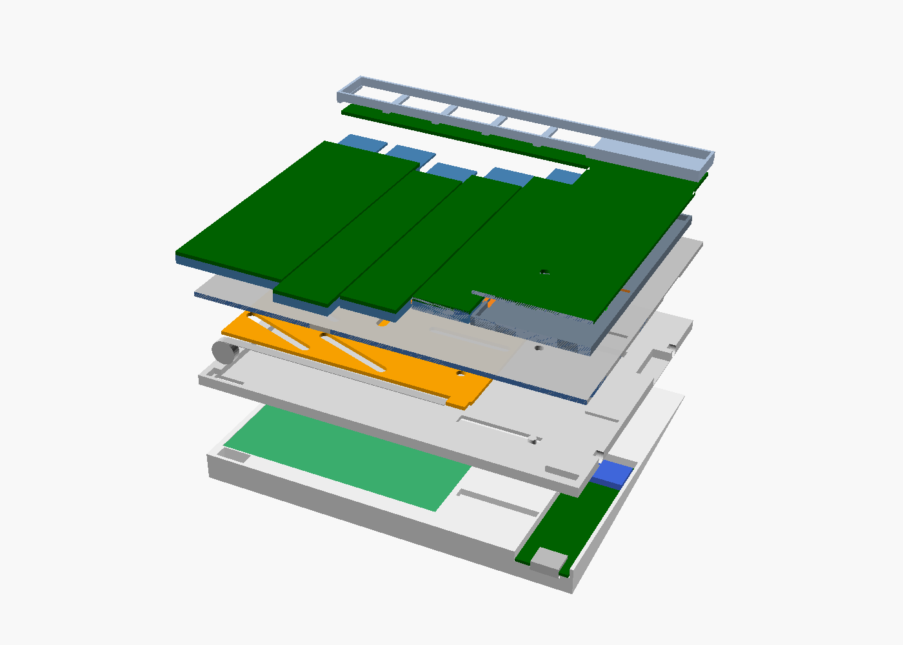

# Rev1 das placas · plano

> **Status:** arquitetura decidida e já refletida no CAD (`yggi_v3.scad`, sem colisões em 0 e 150%). As placas da rev1 ainda não foram desenhadas no KiCad.



A rev0 tem as 6 placas roteadas, com LED RGB por tecla e o MCU externo (um nice!nano ligado por fios). A rev1 coloca a eletrônica dentro do teclado, numa **placa MCU própria na cunha**, e resolve a fixação das placas.

## Decisões

| Assunto | Decisão | Por quê |
|---|---|---|
| Teclas de 2u | **com estabilizador** | sem ele, tab, caps e shift balançam nas pontas |
| Onde fica o MCU | **placa MCU própria na cunha**, sob o bloco fixo | com os estabilizadores, a placa L não tem mais lugar para o módulo: entre o estabilizador (x ≈ 6,1) e o switch (x = 18) sobram 2 mm, e embaixo da barra há só 1,8 mm de altura |
| Antena | **na borda externa** da placa MCU, cercada de plástico | melhor que a posição antiga, no meio da placa L. A bateria fica longe (x ≥ 48). Recomendo a placa-came em FR4, não em aço |
| USB-C | **na face de trás da cunha**, direto na placa MCU | é a parte mais alta da cunha (~9 mm), e o USB não precisa passar pelo flex. Na frente da barra, ele batia no pino central do switch do fn |
| Placa L ↔ placa MCU | **flex de 20 vias** (passo 0,5 mm) por um rasgo no bloco fixo, no chassi e na bandeja | as duas placas são fixas. O único corredor livre fica em x < 12,5, antes do bolsão da placa-came |
| Conector entre as mãos e com a baia | **pogo magnético de 5 pinos**, na face da bandeja | a barra tem só 3 mm de altura (z 6–9), e o conector tem ~4 mm. Os 4 pogo antigos saem |
| Fixação | **1 M2 por coluna na faixa entre F e números + presilhas no trenó**; M2 na placa L | ver abaixo |

## Onde fica cada coisa (quadro da metade esquerda do CAD)

| Peça | Posição | Variável no CAD |
|---|---|---|
| Placa MCU (1,0 mm) | x 1,5–18,5; y 46–106,5 (até a face de trás); topo em z −2,5, peças viradas para cima | `MCUB` |
| Raytac MDBT50Q (10,6 × 15,6 × 2,2 mm) | x 1,8–17,4; y 49–59,6, deitado em x, com a **antena na ponta de x = 1,8** | `MOD` |
| USB-C mid-mount | x 4,5–13,5, na borda de trás da placa MCU | `USBC` |
| Rasgo do flex | x 1,5–13; y 68,6–70 (entre a tecla tab e o LED RGB da tecla de números de fora) | `FLEX` |
| Conector magnético (outra mão) | face interna da bandeja, na ponta da barra, centro em y = 9, z 0,3–4,3 | `MAGC`, `MAGC_Y[0]` |
| Conector magnético (baia, só na esquerda) | face externa da bandeja, centro em y = 32,25 | `MAGC_Y[1]` |
| Fios da bateria | canal na cunha, da bateria (x = 48) até a placa MCU | — |

A cunha tem 4,5 mm de altura na frente da placa MCU (y = 46) e 9,3 mm atrás. A placa fica num bolsão de 3,7 mm, aberto na face de trás para o USB-C.

## O que vai em cada placa

**Placa L (rev1):** igual à rev0, trocando o cabeçalho do nice!nano pelos **pads do flex de 20 vias**, e com os furos M2 e os recortes dos estabilizadores. Os 20 sinais do flex:

| Sinais | Quantos |
|---|---|
| R0–R5, COL0–COL6 (matriz) | 13 |
| DIN, VLED, GND (LEDs RGB) | 3 |
| LED1–LED3 (tecla Yggi; na direita ficam livres) | 3 |
| GND extra | 1 |

**Placa MCU (nova, uma por mão):**

```
USB-C VBUS ──►|── VIN ──► carregador (MCP73831, 500 mA) ──► BAT ──► nRF VDDH (REG0 → 3,3 V)
conector VBUS ─────┘                                          └─► load switch ──► VLED (LEDs RGB)
```

- **MDBT50Q** com a área sem cobre da antena (12,4 mm de largura, em todas as camadas) na borda.
- **Sem regulador externo:** o nRF52840 aceita a bateria direto no VDDH (2,5–5,5 V), e o regulador interno gera os 3,3 V.
- **Um USB-C carrega as duas mãos:** o VBUS passa pelo conector magnético. Um diodo Schottky em cada USB-C impede que uma mão alimente o USB-C da outra.
- **LEDs RGB pela bateria (3,5–4,2 V), com load switch e limite de corrente** (ex.: SY6280, EN em 3,3 V): corta os ~75 mA que os LEDs gastam parados e protege as trilhas e o flex. O dado de 3,3 V funciona com o LED em 4,2 V (VIH ≈ 2,9 V).
- Proteção ESD no USB, resistores de 5,1 kΩ nos CC, divisor para medir a bateria, pads de SWD (gravar o bootloader no módulo novo) e de reset, pads da bateria (célula com proteção embutida) e conector do flex.

## Pinos do nRF52840 (por mão)

| Função | Pinos | Esquerda | Direita |
|---|---|---|---|
| Matriz | 6 linhas + 7 colunas | 13 | 13 |
| Dados dos LEDs RGB | 1 | 1 | 1 |
| LEDs da tecla Yggi | 3 | 3 | — |
| Liga/desliga dos LEDs RGB | 1 | 1 | 1 |
| Nível da bateria (analógico) | 1 | 1 | 1 |
| Conector com a outra mão (2 de dados + detecção) | 3 | 3 | 3 |
| Conector da baia (2 de dados + detecção) | 3 | 3 | — |
| **Total de GPIO** (o MDBT50Q tem 48) | | **25** | **19** |

## Conector magnético de 5 pinos

| Pino | Função |
|---|---|
| 1 | VBUS (carga compartilhada) |
| 2 | GND |
| 3 | dados A |
| 4 | dados B |
| 5 | detecção (encaixado ou não) |

Os dados servem para o split com fio quando as mãos estão encaixadas (**confirmar** o suporte atual do ZMK) ou para conversar com o e-reader. O tamanho em `MAGC` (16,5 × 4 × 6 mm) é estimado: **ajustar quando a peça for escolhida**. Os fios vão do conector até a placa MCU por dentro da bandeja e da cunha.

## Fixação

- **Colunas:** 1 parafuso M2 por coluna na faixa entre F e números (a cabeça fica visível no vão entre os keycaps), mais presilhas impressas no trenó que prendem as pontas da placa. Os blocos do jumper vão ceder ~4,5 mm de largura na faixa, então os pads serão reorganizados.
- **Placa L:** M2 nos cantos do bloco fixo e na barra, entre as teclas.
- **Placa MCU:** 2 M2 na cunha.

## Falta fechar

1. **Modelo do estabilizador de 2u** (medidas dos recortes na placa L). As placas da rev0 não têm esses recortes.
2. **Peças exatas na LCSC:** USB-C mid-mount, conector magnético, conector do flex, load switch e diodos. Todas precisam caber nos 3,7 mm do bolsão.
3. **Split com fio pelo conector:** confirmar no ZMK. Se não houver suporte, os 2 pinos de dados ficam para o e-reader e para uso futuro.
4. **Onde prender os fios** do conector magnético até a placa MCU (canal na bandeja).
